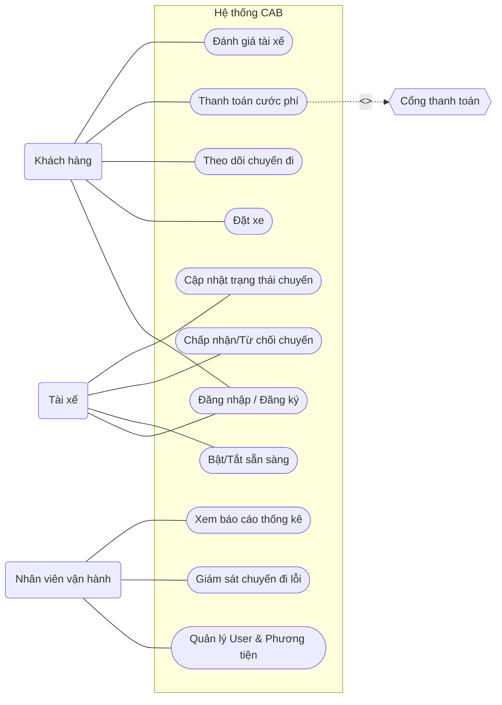

## Bước 1: đọc và phân tích yêu cầu: hiểu về business context và business problem
trả lời câu hỏi: khách hàng muốn giải quyết vấn đề gì
vì sao không thể đáp ứng, ai sử dụng hệ thống này,
giá trị sau khi tạo ra
**1. Khách hàng muốn giải quyết vấn đề gì?**
Công ty ABC muốn xây dựng **CAB System** để tự động hóa và quản lý tập trung toàn bộ quy trình đặt xe: **đặt xe → tìm tài xế → thực hiện chuyến → tính cước → thanh toán → đánh giá**. 

**2. Vì sao hệ thống hiện tại không thể đáp ứng?**

* Phân công tài xế chủ yếu **thủ công**.
* Khách hàng khó **theo dõi trạng thái chuyến đi**.
* Thông tin **thanh toán chưa được quản lý tập trung**.
* Khó **mở rộng hệ thống** khi số lượng khách hàng và tài xế tăng. 

**3. Ai sử dụng hệ thống?**

* **Customer:** đặt xe, theo dõi chuyến, thanh toán, đánh giá.
* **Driver:** nhận/từ chối chuyến, cập nhật vị trí và trạng thái chuyến.
* **Operation Staff/Admin:** quản lý khách hàng, tài xế, phương tiện, chuyến đi và báo cáo. 

**4. Giá trị sau khi tạo ra hệ thống?**

* Tự động hóa quy trình đặt và điều phối xe.
* Cải thiện trải nghiệm Customer và Driver.
* Quản lý dữ liệu và hoạt động tập trung.
* Giảm khó khăn cho bộ phận vận hành.
* Có khả năng **scale và mở rộng tính năng** trong tương lai.

## Bước 2: Xác định stakeholder trong dự án này
lập bảng cột đầu stakeholder nào, cột 2 vai trò là gì
vẽ ma trận stakeholder, cho biết mức độ ảnh hưởng của các vai trò trong hệ thống


Dựa trên yêu cầu của CAB System, các stakeholder chính gồm: 

| Stakeholder                 | Vai trò                                                               |
| --------------------------- | --------------------------------------------------------------------- |
| **Ban giám đốc ABC**        | Đưa ra mục tiêu, yêu cầu kinh doanh và định hướng phát triển hệ thống |
| **Customer**                | Đặt xe, theo dõi chuyến, thanh toán và đánh giá tài xế                |
| **Driver**                  | Nhận/từ chối chuyến, thực hiện chuyến và cập nhật trạng thái/vị trí   |
| **Operation Staff / Admin** | Quản lý khách hàng, tài xế, phương tiện, chuyến đi và xử lý sự cố     |
| **Business Analyst (BA)**   | Thu thập, phân tích và làm rõ yêu cầu với các bên liên quan           |
| **Development Team**        | Thiết kế, phát triển, tích hợp và triển khai CAB System               |
| **Payment Provider**        | Cung cấp dịch vụ xử lý thanh toán điện tử                             |
| **Notification Provider**   | Cung cấp kênh gửi thông báo cho Customer và Driver                    |

### Stakeholder Matrix

Có thể phân loại theo **Power (mức độ ảnh hưởng/quyền lực)** và **Interest (mức độ quan tâm đến hệ thống)**:

```text
                     POWER / INFLUENCE
                           HIGH
                            ↑
                            │
       KEEP SATISFIED       │        MANAGE CLOSELY
                            │
    Payment Provider        │    Ban giám đốc ABC
                            │    Operation Staff/Admin
                            │    BA
                            │    Development Team
                            │
LOW INTEREST ───────────────┼──────────────────── HIGH INTEREST
                            │
       MONITOR              │        KEEP INFORMED
                            │
 Notification Provider      │    Customer
                            │    Driver
                            │
                            ↓
                           LOW
```

### Mức độ ảnh hưởng

| Stakeholder               | Mức độ ảnh hưởng  | Lý do chính                                                        |
| ------------------------- | ----------------- | ------------------------------------------------------------------ |
| **Ban giám đốc ABC**      | 🔴 Cao            | Quyết định mục tiêu, phạm vi và yêu cầu kinh doanh                 |
| **Operation Staff/Admin** | 🔴 Cao            | Trực tiếp vận hành và quản lý hệ thống                             |
| **BA**                    | 🔴 Cao            | Làm rõ requirement và kết nối stakeholder với Development Team     |
| **Development Team**      | 🔴 Cao            | Quyết định và triển khai giải pháp kỹ thuật                        |
| **Payment Provider**      | 🟠 Trung bình–Cao | Ảnh hưởng trực tiếp đến chức năng thanh toán điện tử               |
| **Customer**              | 🟠 Trung bình     | Người sử dụng chính, yêu cầu ảnh hưởng lớn đến chức năng đặt xe    |
| **Driver**                | 🟠 Trung bình     | Người trực tiếp tham gia Driver Matching và Trip                   |
| **Notification Provider** | 🟡 Trung bình     | Ảnh hưởng đến Notification nhưng không quyết định toàn bộ hệ thống |

## Bước 3: Xác định Business Goal


Dựa trên yêu cầu của khách hàng, các **Business Goal** chính của CAB System là: 

| Business Goal                                   | Mục tiêu                                                                           |
| ----------------------------------------------- | ---------------------------------------------------------------------------------- |
| **BG01 – Tự động hóa quy trình đặt xe**         | Giảm xử lý thủ công từ đặt xe, tìm tài xế đến hoàn thành chuyến                    |
| **BG02 – Cải thiện trải nghiệm khách hàng**     | Cho phép khách hàng đặt xe, theo dõi trạng thái, thanh toán và đánh giá thuận tiện |
| **BG03 – Tối ưu điều phối tài xế**              | Tìm và phân công tài xế phù hợp, ưu tiên tài xế gần và sẵn sàng                    |
| **BG04 – Quản lý vận hành tập trung**           | Quản lý Customer, Driver, Vehicle, Trip và Transaction trên một hệ thống           |
| **BG05 – Hỗ trợ theo dõi hoạt động kinh doanh** | Cung cấp báo cáo về chuyến đi, doanh thu, tỷ lệ hoàn thành/hủy và hiệu quả tài xế  |
| **BG06 – Đảm bảo khả năng mở rộng**             | Phục vụ số lượng lớn người dùng và cho phép mở rộng từng thành phần khi tải tăng   |
| **BG07 – Hỗ trợ phát triển lâu dài**            | Dễ bổ sung loại dịch vụ, phương thức thanh toán, kênh thông báo và tính năng mới   |

 ## Bước 4: Xác định phạm vi hệ thống

Dựa trên yêu cầu khách hàng, phạm vi của **CAB System** có thể chia thành **In Scope** và **Out of Scope**. 

### In Scope

| Phạm vi                         | Nội dung                                                                     |
| ------------------------------- | ---------------------------------------------------------------------------- |
| **Account Management**          | Đăng ký, đăng nhập, cập nhật thông tin Customer/Driver                       |
| **Booking Management**          | Tạo yêu cầu đặt xe, chọn điểm đón, điểm đến và loại xe                       |
| **Driver & Vehicle Management** | Quản lý tài xế, phương tiện, trạng thái hoạt động và vị trí                  |
| **Driver Matching**             | Tìm, đề xuất và phân công tài xế phù hợp                                     |
| **Trip Management**             | Theo dõi và cập nhật trạng thái chuyến đi                                    |
| **Fare Management**             | Tính số tiền cần thanh toán sau chuyến                                       |
| **Payment**                     | Hỗ trợ tiền mặt và tích hợp thanh toán điện tử                               |
| **Notification**                | Thông báo các sự kiện của chuyến cho Customer/Driver                         |
| **Rating**                      | Customer đánh giá Driver sau chuyến                                          |
| **Administration**              | Quản lý Customer, Driver, Vehicle, Trip và Transaction                       |
| **Reporting**                   | Báo cáo chuyến đi, doanh thu, tỷ lệ hoàn thành/hủy, hiệu quả Driver          |
| **Security & Audit**            | Authentication, Authorization, bảo vệ dữ liệu và lưu vết thao tác quan trọng |

### Out of Scope / Chưa được xác định

Tài liệu **không xác định chi tiết** các nội dung sau nên chưa thể đưa vào phạm vi triển khai cụ thể:

* Công thức tính cước chi tiết.
* Thuật toán/tiêu chí ưu tiên Driver cụ thể.
* Thời gian Driver phải phản hồi.
* Chính sách hủy chuyến.
* Xử lý chi tiết khi mất kết nối mạng.
* Thời gian lưu trữ dữ liệu.
* Nhà cung cấp Payment/Notification cụ thể.

Các nội dung này cần **BA làm rõ với stakeholder** trước khi Development Team triển khai. 

**Phạm vi tổng quát:** CAB System quản lý quy trình **Customer đặt xe → tìm Driver → thực hiện Trip → tính cước → Payment → Notification → Rating**, đồng thời hỗ trợ quản trị và báo cáo cho doanh nghiệp.

## Bước 5: Chuyển đổi business requirement


| **Business Goal**                         | **Business Requirement**                                                                                     | **Mục đích/giá trị**                                        |
| ----------------------------------------- | ------------------------------------------------------------------------------------------------------------ | ----------------------------------------------------------- |
| **BG1 – Tự động hóa đặt xe**              | **BR01:** Hệ thống cho phép khách hàng tạo yêu cầu đặt xe.                                                   | Giúp khách hàng đặt xe nhanh chóng, giảm thao tác thủ công. |
| **BG1 – Tự động hóa đặt xe**              | **BR02:** Hệ thống tự động tìm và phân công tài xế phù hợp.                                                  | Giảm thời gian tìm tài xế và nâng cao hiệu quả vận hành.    |
| **BG1 – Tự động hóa đặt xe**              | **BR03:** Hệ thống tiếp tục tìm tài xế khác khi tài xế từ chối hoặc không phản hồi.                          | Tăng khả năng tìm được tài xế cho khách hàng.               |
| **BG2 – Nâng cao trải nghiệm khách hàng** | **BR04:** Hệ thống cho phép khách hàng theo dõi trạng thái và vị trí chuyến đi.                              | Khách hàng chủ động nắm được tình trạng chuyến xe.          |
| **BG2 – Nâng cao trải nghiệm khách hàng** | **BR05:** Hệ thống cho phép khách hàng xem lịch sử và đánh giá tài xế.                                       | Nâng cao trải nghiệm và chất lượng dịch vụ.                 |
| **BG3 – Nâng cao hiệu quả vận hành**      | **BR06:** Hệ thống cho phép nhân viên quản lý khách hàng, tài xế, phương tiện và chuyến đi.                  | Quản lý tập trung, giảm công việc thủ công.                 |
| **BG4 – Quản lý thanh toán**              | **BR07:** Hệ thống tính cước và hỗ trợ thanh toán tiền mặt hoặc điện tử.                                     | Quản lý doanh thu và thanh toán thuận tiện.                 |
| **BG5 – Tăng khả năng đáp ứng chuyến**    | **BR08:** Hệ thống lưu vị trí và trạng thái hoạt động của tài xế.                                            | Hỗ trợ tìm tài xế gần khách hàng và rút ngắn thời gian chờ. |
| **BG6 – Ổn định và bảo mật**              | **BR09:** Hệ thống xác thực, phân quyền và bảo vệ dữ liệu người dùng.                                        | Đảm bảo an toàn và bảo mật thông tin.                       ||
**BG7 – Khả năng mở rộng**                | **BR10:** Hệ thống cho phép tích hợp thêm dịch vụ, phương thức thanh toán và kênh thông báo.                 | Giúp hệ thống dễ phát triển trong tương lai.                |
| **BG8 – Hỗ trợ ra quyết định**            | **BR11:** Hệ thống cung cấp báo cáo về số chuyến, doanh thu, tỷ lệ hoàn thành, tỷ lệ hủy và hiệu quả tài xế. | Giúp ban lãnh đạo theo dõi và ra quyết định.                |

## Bước 6: Business process
| Bước   | Business Process    | Mô tả                                                                           |
| ------ | ------------------- | ------------------------------------------------------------------------------- |
| **1**  | **Create Booking**  | Customer nhập điểm đón, điểm đến, loại xe và gửi yêu cầu                        |
| **2**  | **Find Driver**     | Hệ thống tìm Driver phù hợp dựa trên vị trí và trạng thái sẵn sàng              |
| **3**  | **Accept/Reject**   | Driver nhận thông báo và Accept hoặc Reject chuyến                              |
| **4**  | **Assign Driver**   | Driver chấp nhận → hệ thống phân công; từ chối/không phản hồi → tìm Driver khác |
| **5**  | **Pickup Customer** | Driver đến điểm đón và cập nhật trạng thái                                      |
| **6**  | **Execute Trip**    | Driver đón khách và thực hiện chuyến đi                                         |
| **7**  | **Complete Trip**   | Driver cập nhật chuyến đã hoàn thành                                            |
| **8**  | **Calculate Fare**  | Hệ thống tính số tiền Customer phải trả                                         |
| **9**  | **Payment**         | Customer thanh toán bằng Cash hoặc Electronic Payment                           |
| **10** | **Rating**          | Customer đánh giá Driver sau chuyến                                             |
| **11** | **Record & Report** | Hệ thống lưu lịch sử và cung cấp dữ liệu phục vụ quản lý/báo cáo                |

Dùng công cụ mermaid vẽ sơ đồ 

## Bước 7: Phân rã yêu cầu chức năng
| Mã       | Yêu cầu chức năng                                              |
| -------- | -------------------------------------------------------------- |
| **FR01** | Kiểm tra tài xế đang sẵn sàng nhận chuyến                      |
| **FR02** | Tìm tài xế phù hợp và gần điểm đón                             |
| **FR03** | Gửi yêu cầu nhận chuyến cho tài xế                             |
| **FR04** | Cho phép tài xế chấp nhận hoặc từ chối chuyến                  |
| **FR05** | Tự động tìm tài xế khác khi tài xế từ chối hoặc không phản hồi |
| **FR06** | Thông báo cho khách hàng khi tài xế được phân công             |
| **FR07** | Theo dõi vị trí hiện tại của tài xế                            |
| **FR08** | Theo dõi trạng thái chuyến đi                                  |
| **FR09** | Cho phép tài xế cập nhật trạng thái chuyến                     |
| **FR10** | Tính cước chuyến đi                                            |
| **FR11** | Hỗ trợ thanh toán tiền mặt                                     |
| **FR12** | Hỗ trợ thanh toán điện tử                                      |
| **FR13** | Xử lý và thông báo khi thanh toán thất bại                     |
| **FR14** | Gửi thông báo cho khách hàng và tài xế                         |
| **FR15** | Lưu và xem lịch sử chuyến đi                                   |
| **FR16** | Cho phép khách hàng đánh giá tài xế                            |
| **FR17** | Quản lý thông tin khách hàng                                   |
| **FR18** | Quản lý thông tin tài xế                                       |
| **FR19** | Quản lý thông tin phương tiện                                  |
| **FR20** | Quản lý và theo dõi các chuyến đi                              |
| **FR21** | Tra cứu lịch sử giao dịch                                      |
| **FR22** | Xử lý các chuyến đi bị lỗi                                     |
| **FR23** | Phân quyền người sử dụng hệ thống                              |
| **FR24** | Ghi nhận nhật ký các thao tác quan trọng                       |
| **FR25** | Cung cấp báo cáo và thống kê hoạt động                         |

## Bước 8: Những quy tắc nghiệp vụ và ngoại lệ
### 1. Business Rules

| ID       | Quy tắc nghiệp vụ                                                                       |
| -------- | --------------------------------------------------------------------------------------- |
| **BR01** | Customer và Driver phải được xác thực trước khi sử dụng các chức năng yêu cầu tài khoản |
| **BR02** | Chỉ Driver đang ở trạng thái sẵn sàng mới được xét nhận chuyến                          |
| **BR03** | Driver Matching phải dựa trên vị trí, trạng thái sẵn sàng và các tiêu chí vận hành khác |
| **BR04** | Nếu Driver từ chối hoặc không phản hồi, hệ thống phải tự động tìm Driver khác           |
| **BR05** | Customer không cần tạo lại Booking khi Driver đầu tiên không nhận chuyến                |
| **BR06** | Fare được tính dựa trên loại dịch vụ và thông tin chuyến đi                             |
| **BR07** | Electronic Payment phải được xử lý thông qua Payment Provider bên ngoài                 |
| **BR08** | CAB System không lưu trực tiếp thông tin nhạy cảm của thẻ hoặc tài khoản thanh toán     |
| **BR09** | Customer chỉ có thể đánh giá Driver sau khi chuyến đi hoàn thành                        |
| **BR10** | Các chức năng quản trị nhạy cảm phải được kiểm soát quyền truy cập                      |
| **BR11** | Các thao tác quan trọng phải được lưu Audit Log                                         |

### 2. Business Exceptions

| Ngoại lệ                         | Cách xử lý                                                            |
| -------------------------------- | --------------------------------------------------------------------- |
| **Driver từ chối chuyến**        | Tiếp tục tìm Driver khác                                              |
| **Driver không phản hồi**        | Chuyển sang Driver khác                                               |
| **Không tìm được Driver**        | Thông báo rõ ràng cho Customer                                        |
| **Electronic Payment thất bại**  | Thông báo Customer và cho phép xử lý lại theo chính sách doanh nghiệp |
| **Payment Service gặp lỗi**      | Không được làm toàn bộ hệ thống đặt xe ngừng hoạt động                |
| **Notification Service gặp lỗi** | Không được làm ảnh hưởng toàn bộ quá trình Booking                    |

## Bước 9: Mô hình hoá dữ liệu

Dựa trên yêu cầu hiện tại, các **Business Entity** chính của CAB System có thể xác định như sau. 

| Entity           | Dữ liệu chính                                                           |
| ---------------- | ----------------------------------------------------------------------- |
| **Customer**     | CustomerID, Name, Phone, Email, Profile                                 |
| **Driver**       | DriverID, Name, Phone, Status, CurrentLocation                          |
| **Vehicle**      | VehicleID, DriverID, VehicleType, PlateNumber, VehicleInfo              |
| **Booking**      | BookingID, CustomerID, PickupLocation, Destination, ServiceType, Status |
| **Trip**         | TripID, BookingID, DriverID, StartTime, EndTime, TripStatus             |
| **Location**     | LocationID, DriverID, Latitude, Longitude, Timestamp                    |
| **Fare**         | FareID, TripID, Amount, ServiceType                                     |
| **Payment**      | PaymentID, TripID, Method, Amount, PaymentStatus                        |
| **Rating**       | RatingID, TripID, CustomerID, DriverID, Score, Comment                  |
| **Notification** | NotificationID, UserID, Type, Content, Status                           |
| **Transaction**  | TransactionID, PaymentID, Amount, Status, CreatedAt                     |
| **AuditLog**     | LogID, UserID, Action, Timestamp                                        |

### Quan hệ dữ liệu chính

```text
Customer
   │
   └── creates ──> Booking
                     │
                     └── generates ──> Trip
                                        │
Driver ───────────────┘                 │
   │                                    ├── Fare
   ├── Vehicle                          ├── Payment
   └── Location                         └── Rating

Payment ──> Transaction

Customer / Driver
       │
       └── Notification

User/Admin
       │
       └── AuditLog
```

### Cardinality cơ bản

* Một **Customer** có thể tạo nhiều **Booking**.
* Một **Booking** tương ứng với một chuyến được thực hiện sau khi tìm được Driver.
* Một **Driver** có thể thực hiện nhiều **Trip** theo thời gian.
* Một **Driver** có phương tiện và nhiều bản ghi **Location**.
* Một **Trip** có thông tin **Fare** và **Payment**.
* Một **Trip hoàn thành** có thể có **Rating** từ Customer.
* Một **Payment** có thể phát sinh dữ liệu **Transaction**.
## Bước 10: Xác định yêu cầu không phải chức năng

| Nhóm NFR                       | Yêu cầu                                                                                       |
| ------------------------------ | --------------------------------------------------------------------------------------------- |
| **Performance & Scalability**  | Hệ thống phải hoạt động ổn định khi nhu cầu tăng cao và các thành phần có thể scale độc lập   |
| **Availability & Reliability** | Lỗi ở Payment hoặc Notification không được làm toàn bộ hệ thống đặt xe ngừng hoạt động        |
| **Maintainability**            | Có thể triển khai hoặc thay đổi từng phần mà hạn chế ảnh hưởng đến chức năng đang chạy        |
| **Extensibility**              | Dễ bổ sung Service Type, Payment Method, Payment Provider, Notification Provider              |
| **Security**                   | Customer và Driver phải được Authentication trước khi dùng chức năng yêu cầu tài khoản        |
| **Authorization**              | Các thao tác Admin nhạy cảm phải được phân quyền                                              |
| **Data Protection**            | Bảo vệ thông tin cá nhân, phương tiện, vị trí và giao dịch                                    |
| **Auditability**               | Lưu vết các thao tác quan trọng để kiểm tra khi có sự cố                                      |
| **Integration**                | Hỗ trợ tích hợp Payment Provider bên ngoài mà không lưu trực tiếp dữ liệu thanh toán nhạy cảm |
| **Deployability**              | Cho phép triển khai chức năng mới từng phần, giảm ảnh hưởng đến toàn hệ thống                 |
## Bước 11: Tiến hành thiết kế các use case(UC)


## Bước 12: Đặc tả use case 


### UC01 – Đăng nhập

| Thuộc tính        | Nội dung                                                                   |
| ----------------- | -------------------------------------------------------------------------- |
| **Actor**         | Customer, Driver, Admin                                                    |
| **Precondition**  | Người dùng đã có tài khoản                                                 |
| **Main Flow**     | 1. Nhập thông tin đăng nhập. 2. Hệ thống xác thực. 3. Đăng nhập thành công |
| **Exception**     | Sai thông tin đăng nhập → thông báo lỗi                                    |
| **Postcondition** | Người dùng được truy cập các chức năng theo quyền                          |

### UC02 – Tạo Booking

| Thuộc tính        | Nội dung                                                                                           |
| ----------------- | -------------------------------------------------------------------------------------------------- |
| **Actor**         | Customer                                                                                           |
| **Precondition**  | Customer đã đăng nhập                                                                              |
| **Main Flow**     | 1. Nhập điểm đón. 2. Nhập điểm đến. 3. Chọn loại xe. 4. Gửi yêu cầu. 5. Hệ thống tiếp nhận Booking |
| **Exception**     | Không tìm được Driver → thông báo Customer                                                         |
| **Postcondition** | Booking được tạo và chuyển sang quá trình tìm Driver                                               |

### UC03 – Driver Matching

| Thuộc tính        | Nội dung                                                                                                                   |
| ----------------- | -------------------------------------------------------------------------------------------------------------------------- |
| **Actor**         | CAB System, Driver                                                                                                         |
| **Precondition**  | Có Booking mới                                                                                                             |
| **Main Flow**     | 1. Tìm Driver phù hợp theo vị trí và trạng thái. 2. Gửi yêu cầu cho Driver. 3. Driver Accept. 4. Hệ thống phân công Driver |
| **Alternative**   | Driver Reject hoặc không phản hồi → tìm Driver khác                                                                        |
| **Exception**     | Không còn Driver phù hợp → thông báo Customer                                                                              |
| **Postcondition** | Driver được gán cho Booking hoặc Booking thất bại do không tìm được Driver                                                 |

### UC04 – Thực hiện chuyến đi

| Thuộc tính        | Nội dung                                                                                                                                             |
| ----------------- | ---------------------------------------------------------------------------------------------------------------------------------------------------- |
| **Actor**         | Driver, Customer                                                                                                                                     |
| **Precondition**  | Driver đã Accept Booking                                                                                                                             |
| **Main Flow**     | 1. Driver đến điểm đón. 2. Cập nhật `Arrived`. 3. Đón Customer. 4. Cập nhật `Picked Up/In Progress`. 5. Di chuyển đến điểm đến. 6. Hoàn thành chuyến |
| **Exception**     | Tài liệu chưa xác định chi tiết cách xử lý mất kết nối hoặc chuyến bị gián đoạn                                                                      |
| **Postcondition** | Trip chuyển sang `Completed`                                                                                                                         |

### UC05 – Tính cước

| Thuộc tính        | Nội dung                                                                                     |
| ----------------- | -------------------------------------------------------------------------------------------- |
| **Actor**         | CAB System                                                                                   |
| **Precondition**  | Trip đã hoàn thành                                                                           |
| **Main Flow**     | 1. Lấy loại dịch vụ và thông tin chuyến. 2. Tính Fare. 3. Hiển thị số tiền Customer phải trả |
| **Exception**     | Công thức tính cước cụ thể chưa được khách hàng xác định                                     |
| **Postcondition** | Fare của Trip được xác định                                                                  |

### UC06 – Thanh toán

| Thuộc tính        | Nội dung                                                                                                                                       |
| ----------------- | ---------------------------------------------------------------------------------------------------------------------------------------------- |
| **Actor**         | Customer, Payment Provider                                                                                                                     |
| **Precondition**  | Trip hoàn thành và đã tính Fare                                                                                                                |
| **Main Flow**     | 1. Customer chọn Cash hoặc Electronic Payment. 2. Nếu điện tử, gửi giao dịch tới Payment Provider. 3. Nhận kết quả. 4. Cập nhật Payment Status |
| **Alternative**   | Customer chọn tiền mặt                                                                                                                         |
| **Exception**     | Electronic Payment thất bại → thông báo Customer và cho phép xử lý lại theo chính sách doanh nghiệp                                            |
| **Postcondition** | Kết quả Payment được lưu                                                                                                                       |

### UC07 – Đánh giá Driver

| Thuộc tính        | Nội dung                                                                                  |
| ----------------- | ----------------------------------------------------------------------------------------- |
| **Actor**         | Customer                                                                                  |
| **Precondition**  | Trip đã hoàn thành                                                                        |
| **Main Flow**     | 1. Customer chọn chuyến. 2. Nhập đánh giá Driver. 3. Gửi đánh giá. 4. Hệ thống lưu Rating |
| **Postcondition** | Rating được liên kết với Trip và Driver                                                   |

### UC08 – Quản lý hệ thống

| Thuộc tính        | Nội dung                                                                                           |
| ----------------- | -------------------------------------------------------------------------------------------------- |
| **Actor**         | Operation Staff / Admin                                                                            |
| **Precondition**  | Nhân viên đã đăng nhập và có quyền phù hợp                                                         |
| **Main Flow**     | Quản lý Customer, Driver, Vehicle, Trip; xem Transaction; theo dõi chuyến; xử lý sự cố; xem Report |
| **Exception**     | Không đủ quyền → từ chối thao tác nhạy cảm                                                         |
| **Postcondition** | Dữ liệu quản trị được cập nhật và thao tác quan trọng được lưu vết                                 |


## Bước 13: Acception tiêu chí chấp nhận AC


Dựa trên các Use Case và yêu cầu của CAB System, có thể xác định các **Acceptance Criteria (AC)** chính như sau. 

| ID       | Use Case              | Acceptance Criteria                                                                                              |
| -------- | --------------------- | ---------------------------------------------------------------------------------------------------------------- |
| **AC01** | Đăng nhập             | Người dùng nhập đúng thông tin thì đăng nhập thành công; nhập sai thì hệ thống thông báo lỗi                     |
| **AC02** | Tạo Booking           | Customer nhập đầy đủ điểm đón, điểm đến, loại xe và gửi yêu cầu thì Booking được tạo                             |
| **AC03** | Driver Matching       | Hệ thống chỉ tìm Driver phù hợp dựa trên vị trí, trạng thái sẵn sàng và tiêu chí vận hành                        |
| **AC04** | Driver Reject/Timeout | Nếu Driver từ chối hoặc không phản hồi, hệ thống tiếp tục tìm Driver khác mà Customer không phải tạo lại Booking |
| **AC05** | Không tìm được Driver | Hệ thống phải thông báo rõ ràng cho Customer                                                                     |
| **AC06** | Theo dõi Trip         | Customer xem được Driver đã nhận chuyến, ETA và trạng thái hiện tại của Trip                                     |
| **AC07** | Cập nhật Trip         | Driver có thể cập nhật các trạng thái: Arrived, Picked Up, In Progress, Completed                                |
| **AC08** | Tính Fare             | Khi Trip hoàn thành, hệ thống tính và hiển thị số tiền Customer phải trả                                         |
| **AC09** | Payment               | Customer có thể chọn Cash hoặc Electronic Payment                                                                |
| **AC10** | Payment Failure       | Nếu thanh toán điện tử thất bại, hệ thống thông báo Customer và cho phép xử lý lại theo chính sách doanh nghiệp  |
| **AC11** | Rating                | Customer chỉ có thể đánh giá Driver sau khi Trip đã hoàn thành                                                   |
| **AC12** | Notification          | Customer/Driver nhận được thông báo tại các sự kiện quan trọng của chuyến                                        |
| **AC13** | Admin Permission      | Người không có quyền không được thực hiện thao tác quản trị nhạy cảm                                             |
| **AC14** | Reporting             | Admin/Ban quản lý xem được báo cáo số chuyến, doanh thu, tỷ lệ hoàn thành/hủy và hiệu quả Driver                 |
| **AC15** | Audit                 | Các thao tác quan trọng phải được lưu vết để phục vụ kiểm tra                                                    |


## Bước 14: Truy xuất nguồn gốc yêu cầu
| Business Goal                  | Business Requirement       | Functional Requirement | Use Case                         | Acceptance Criteria                                         |
| ------------------------------ | -------------------------- | ---------------------- | -------------------------------- | ----------------------------------------------------------- |
| **BG01** Tự động hóa đặt xe    | Customer có thể yêu cầu xe | Tạo và quản lý Booking | **UC02** Tạo Booking             | **AC02** Booking được tạo khi thông tin hợp lệ              |
| **BG03** Tối ưu điều phối      | Tìm Driver phù hợp         | Driver Matching        | **UC03** Driver Matching         | **AC03–05** Tìm Driver, xử lý Reject/Timeout/không tìm thấy |
| **BG02** Cải thiện trải nghiệm | Customer theo dõi chuyến   | Trip Tracking          | **UC04** Thực hiện/Theo dõi Trip | **AC06–07** Theo dõi và cập nhật trạng thái Trip            |
| **BG04** Quản lý tập trung     | Quản lý cước chuyến        | Fare Calculation       | **UC05** Tính cước               | **AC08** Tính Fare sau khi Trip hoàn thành                  |
| **BG04** Quản lý tập trung     | Hỗ trợ thanh toán          | Payment Management     | **UC06** Thanh toán              | **AC09–10** Cash/E-payment và xử lý thất bại                |
| **BG02** Cải thiện trải nghiệm | Đánh giá sau chuyến        | Rating Management      | **UC07** Đánh giá Driver         | **AC11** Chỉ đánh giá sau Trip Completed                    |
| **BG02** Cập nhật thông tin    | Gửi thông báo              | Notification           | Send Notification                | **AC12** Thông báo các sự kiện quan trọng                   |
| **BG04** Quản lý vận hành      | Quản trị hệ thống          | Administration         | **UC08** Quản lý hệ thống        | **AC13** Kiểm soát quyền thao tác                           |
| **BG05** Theo dõi kinh doanh   | Cung cấp báo cáo           | Reporting              | View Reports                     | **AC14** Xem được các báo cáo yêu cầu                       |
| **BG04** Kiểm soát hoạt động   | Lưu vết thao tác           | Audit Logging          | Audit                            | **AC15** Thao tác quan trọng được lưu vết                   |
